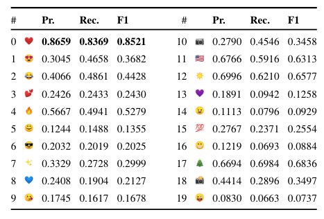
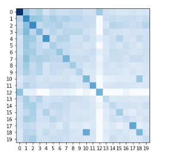
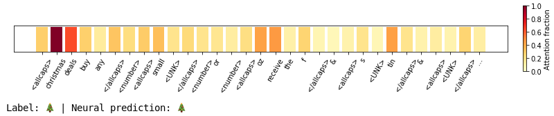

## Addicted to #avocado toast :heart_eyes: Comparing different Neural NLP models for Emoji Prediction

This project was conducted for the *Deep Learning for Natural Language Technologies* course of the Universiteit van Amsterdam's
Master Artificial Intelligence program during the winter term 2018/2019.

### Task description

This SemEval shared tasks aims to explore the predictability of emojis, small ideograms depicting objects, people and
scenes, given the tweet they were used in. An example tweet from the data set is the following:

---
Addicted to #avocado toast. @ Kitchen :heart_eyes:

---
Only tweets with one emoji were included in the data set. No meta data is given. Because only tweets with one of the 20
most frequent emojis in English or Spanish respectively were selected, this task can be seen as a form of multi-label
classification. The tweets were gathered between October 2015 and February 2017. For more information
about the task, consult the original [competition paper](http://www.aclweb.org/anthology/S18-1003).

### Results

The results are split up for the english and the spanish part of the data set. All models' performances were determined
on the test set. Due to limited computational resources, the vocabulary size during training
was limited to 10.000 types. Additionally, the data was pre-processed with the [Ekphrasis](https://github.com/cbaziotis/ekphrasis)
library, which supplies Twitter-specific tools for text normalization.

#### English

|  Model|Precision |Recall  |F1-score  |
|------:|:----------|:-------|:---------|
|Bag-of-Words + Logistic Regression | 0.3450 | 0.3069 | 0.3129 |
|Bag-of-Words + SVM  | 0.2586 | 0.2681 | 0.2549 |
| CNN | 0.3490| 0.2851 | 0.2903 |
| BiLSTM |  0.3252 | 0.3182 |  0.3187|
| BiLSTM + Attention | **0.3505**  | **0.3353** | **0.3378** |


#### Error analysis



Here we can see that the model appears to performs best for the most frequently appearing classes like
 :heart: and :joy: as well as for very distinct classes like :us: and :christmas_tree:.
 Variants of the red heart like :two_hearts:, :purple_heart: and :blue_heart: perform relatively worse.
 Moreover, the model seems to struggle with different nuances of facial expressions like :blush:, :grin:, :sunglasses:,
 :kissing_heart: or :stuck_out_tongue_winking_eye:. However, they are *not* being confused, as this confusion matrix shows:



The only confusions that occur are the mix-up of the two camera-relatex emojis :camera: and :camera: with a flash as well
as :heart: and :sunny:, where, most remarkably, it is apparent that the sun emoji is not mixed up with any other specific
label, which suggests a distinct usage. :stuck_out_tongue_winking_eye: can be seen to be consistently mislabelled as
other emojis, which explains its low performance.



This image give an example of how our best model uses attention: In order to correctly classify the tweet with :christmas_tree:,
it focuses on related vocabulary in the tweet like "christmas", "deals" and to some lesser extend also words like "tin" and "receive".


### Usage

1. Install the dependencies with

```sh
pip install -r requirements.txt
```

2. Read the datasets, process them and serialize the results:

```sh
python tweet_data.py
```

3. Download the pretrained embeddings available [here](https://github.com/cbaziotis/ntua-slp-semeval2018#2---download-our-pre-trained-word-embeddings). Load the pretrained embeddings and serialize only those in the vocabulary by running

```sh
python embeddings.py
```

4. Train and search hyperparameters for a biLSTM:

```sh
python attn_lstm.py
```

5. Monitor training with Tensorboard by running (in the same directory)

```sh
tensorboard --logdir=runs
```

and going to [http://localhost:6006](http://localhost:6006)

Data analysis, model evaluation and other experiments can be found in the [notebooks](notebooks) folder.
